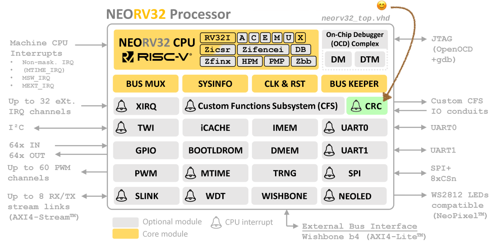
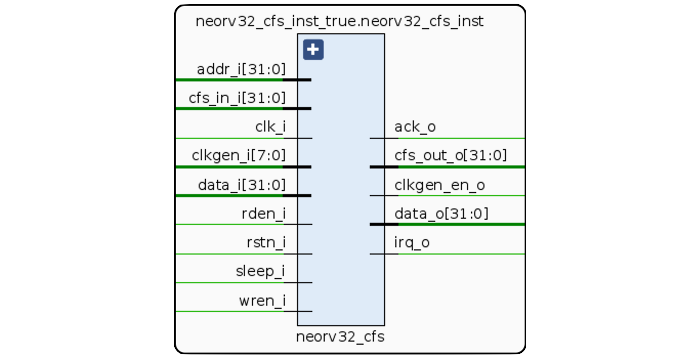
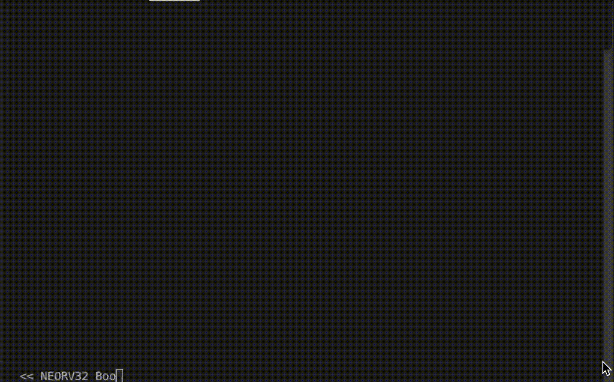

# How to add a custom module - Cyclic Redundancy Check (CRC32) - Nexys A7 Board

* [Overview](#Overview)
* [Introduction](#Introduction)
* [Cyclic Redundancy Check (CRC32)](#Cyclic-Redundancy-Check-(CRC32))
  * [Custom Functions Subsystem (CFS)](#Custom-Functions-Subsystem-(CFS))
  * [Files to be modified](#Files-to-be-modified)
  * [Test Example - Software](#Test-Example---Software)

## Overview



Due to the customizable ability of the NEORV32 Processor, here we are going to go through the process of adding a custom module. Here we are going to add a **Cyclic Redundancy Check (CRC32) module** as an example. For this we are going to use the Nexys A7 Board.

## Introduction

After reading the [user guide](https://stnolting.github.io/neorv32/ug/) and having an idea of how the NEORV32 [executes programs](https://stnolting.github.io/neorv32/ug/#_setup_of_a_new_application_program_project), you are ready to put hands on how to add your custom module.

## Cyclic Redundancy Check (CRC32)

In order to implement a custom module, we have to look into the CFS module first.

### Custom Functions Subsystem (CFS)



The [CFS module](./rtl/core/neorv32_cfs.vhd) provides 32x32-bit memory-mapped registers as an "example/illustrating template" to be modified in the case of implementing design custom logic. So, this is the first module you want to start to play with. In the same way, the CFS module is well commented. Have a read of it before we carry on. 

Also as a rule of thumb, it is good to use the CFS first and test functionality there before you start modifying existing components or adding completely new modules. Due to the simplicity of the CRC32 code, we are going to proceed directly creating the module! You can read more about [the CRC error detection.](https://en.wikipedia.org/wiki/Cyclic_redundancy_check)

Once you have a general idea of the how the CFS is structured, we can duplicate it and modify it to create our CRC32 module.

Now we proceed to create and add to the processor our own CRC32 module called [neorv32_crc32.vhd](./rtl/core/neorv32_crc32.vhd) with our own CRC32 implementation. [Here](./rtl/core/neorv32_crc32.vhd#L121-L165) it is the CRC32 Function Core:

*Note: Please have a look and compare [neorv32_crc32.vhd](./rtl/core/neorv32_crc32.vhd) and [neorv32_cfs.vhd](./rtl/core/neorv32_cfs.vhd) and you will see the similarities!*

```vhdl
  -- CRC32 Function Core ----------------------------------------------------------------------
  -- -------------------------------------------------------------------------------------------
  -- This is where the actual functionality can be implemented.
  -- In this example we are just implementing four r/w registers that invert any value written to them.
  -- crc32_reg_wr(0)(7 downto 0) -- 8-bit data
  -- crc32_reg_wr(1)             -- intemediate Result
  -- crc32_reg_rd(1)             -- final Result
     
  cr32_core: process(crc32_reg_wr(0))
  begin               
   
    crc32_reg_rd(1)(0) <= (crc32_reg_wr(1)(2) xor crc32_reg_wr(1)(8) xor crc32_reg_wr(0)(2));
    crc32_reg_rd(1)(1) <= (crc32_reg_wr(1)(0) xor crc32_reg_wr(1)(3) xor crc32_reg_wr(1)(9) xor crc32_reg_wr(0)(0) xor crc32_reg_wr(0)(3));
    crc32_reg_rd(1)(2) <= (crc32_reg_wr(1)(0) xor crc32_reg_wr(1)(1) xor crc32_reg_wr(1)(4) xor crc32_reg_wr(1)(10) xor crc32_reg_wr(0)(0) xor crc32_reg_wr(0)(1) xor crc32_reg_wr(0)(4));
    crc32_reg_rd(1)(3) <= (crc32_reg_wr(1)(1) xor crc32_reg_wr(1)(2) xor crc32_reg_wr(1)(5) xor crc32_reg_wr(1)(11) xor crc32_reg_wr(0)(1) xor crc32_reg_wr(0)(2) xor crc32_reg_wr(0)(5));
    crc32_reg_rd(1)(4) <= (crc32_reg_wr(1)(0) xor crc32_reg_wr(1)(2) xor crc32_reg_wr(1)(3) xor crc32_reg_wr(1)(6) xor crc32_reg_wr(1)(12) xor crc32_reg_wr(0)(0) xor crc32_reg_wr(0)(2) xor crc32_reg_wr(0)(3) xor crc32_reg_wr(0)(6));
    crc32_reg_rd(1)(5) <= (crc32_reg_wr(1)(1) xor crc32_reg_wr(1)(3) xor crc32_reg_wr(1)(4) xor crc32_reg_wr(1)(7) xor crc32_reg_wr(1)(13) xor crc32_reg_wr(0)(1) xor crc32_reg_wr(0)(3) xor crc32_reg_wr(0)(4) xor crc32_reg_wr(0)(7));
    crc32_reg_rd(1)(6) <= (crc32_reg_wr(1)(4) xor crc32_reg_wr(1)(5) xor crc32_reg_wr(1)(14) xor crc32_reg_wr(0)(4) xor crc32_reg_wr(0)(5));
    crc32_reg_rd(1)(7) <= (crc32_reg_wr(1)(0) xor crc32_reg_wr(1)(5) xor crc32_reg_wr(1)(6) xor crc32_reg_wr(1)(15) xor crc32_reg_wr(0)(0) xor crc32_reg_wr(0)(5) xor crc32_reg_wr(0)(6));
    crc32_reg_rd(1)(8) <= (crc32_reg_wr(1)(1) xor crc32_reg_wr(1)(6) xor crc32_reg_wr(1)(7) xor crc32_reg_wr(1)(16) xor crc32_reg_wr(0)(1) xor crc32_reg_wr(0)(6) xor crc32_reg_wr(0)(7));
    crc32_reg_rd(1)(9) <= (crc32_reg_wr(1)(7) xor crc32_reg_wr(1)(17) xor crc32_reg_wr(0)(7));
    crc32_reg_rd(1)(10) <= (crc32_reg_wr(1)(2) xor crc32_reg_wr(1)(18) xor crc32_reg_wr(0)(2));
    crc32_reg_rd(1)(11) <= (crc32_reg_wr(1)(3) xor crc32_reg_wr(1)(19) xor crc32_reg_wr(0)(3));
    crc32_reg_rd(1)(12) <= (crc32_reg_wr(1)(0) xor crc32_reg_wr(1)(4) xor crc32_reg_wr(1)(20) xor crc32_reg_wr(0)(0) xor crc32_reg_wr(0)(4));
    crc32_reg_rd(1)(13) <= (crc32_reg_wr(1)(0) xor crc32_reg_wr(1)(1) xor crc32_reg_wr(1)(5) xor crc32_reg_wr(1)(21) xor crc32_reg_wr(0)(0) xor crc32_reg_wr(0)(1) xor crc32_reg_wr(0)(5));
    crc32_reg_rd(1)(14) <= (crc32_reg_wr(1)(1) xor crc32_reg_wr(1)(2) xor crc32_reg_wr(1)(6) xor crc32_reg_wr(1)(22) xor crc32_reg_wr(0)(1) xor crc32_reg_wr(0)(2) xor crc32_reg_wr(0)(6));
    crc32_reg_rd(1)(15) <= (crc32_reg_wr(1)(2) xor crc32_reg_wr(1)(3) xor crc32_reg_wr(1)(7) xor crc32_reg_wr(1)(23) xor crc32_reg_wr(0)(2) xor crc32_reg_wr(0)(3) xor crc32_reg_wr(0)(7));
    crc32_reg_rd(1)(16) <= (crc32_reg_wr(1)(0) xor crc32_reg_wr(1)(2) xor crc32_reg_wr(1)(3) xor crc32_reg_wr(1)(4) xor crc32_reg_wr(1)(24) xor crc32_reg_wr(0)(0) xor crc32_reg_wr(0)(2) xor crc32_reg_wr(0)(3) xor crc32_reg_wr(0)(4));
    crc32_reg_rd(1)(17) <= (crc32_reg_wr(1)(0) xor crc32_reg_wr(1)(1) xor crc32_reg_wr(1)(3) xor crc32_reg_wr(1)(4) xor crc32_reg_wr(1)(5) xor crc32_reg_wr(1)(25) xor crc32_reg_wr(0)(0) xor crc32_reg_wr(0)(1) xor crc32_reg_wr(0)(3) xor crc32_reg_wr(0)(4) xor crc32_reg_wr(0)(5));
    crc32_reg_rd(1)(18) <= (crc32_reg_wr(1)(0) xor crc32_reg_wr(1)(1) xor crc32_reg_wr(1)(2) xor crc32_reg_wr(1)(4) xor crc32_reg_wr(1)(5) xor crc32_reg_wr(1)(6) xor crc32_reg_wr(1)(26) xor crc32_reg_wr(0)(0) xor crc32_reg_wr(0)(1) xor crc32_reg_wr(0)(2) xor crc32_reg_wr(0)(4) xor crc32_reg_wr(0)(5) xor crc32_reg_wr(0)(6));
    crc32_reg_rd(1)(19) <= (crc32_reg_wr(1)(1) xor crc32_reg_wr(1)(2) xor crc32_reg_wr(1)(3) xor crc32_reg_wr(1)(5) xor crc32_reg_wr(1)(6) xor crc32_reg_wr(1)(7) xor crc32_reg_wr(1)(27) xor crc32_reg_wr(0)(1) xor crc32_reg_wr(0)(2) xor crc32_reg_wr(0)(3) xor crc32_reg_wr(0)(5) xor crc32_reg_wr(0)(6) xor crc32_reg_wr(0)(7));
    crc32_reg_rd(1)(20) <= (crc32_reg_wr(1)(3) xor crc32_reg_wr(1)(4) xor crc32_reg_wr(1)(6) xor crc32_reg_wr(1)(7) xor crc32_reg_wr(1)(28) xor crc32_reg_wr(0)(3) xor crc32_reg_wr(0)(4) xor crc32_reg_wr(0)(6) xor crc32_reg_wr(0)(7));
    crc32_reg_rd(1)(21) <= (crc32_reg_wr(1)(2) xor crc32_reg_wr(1)(4) xor crc32_reg_wr(1)(5) xor crc32_reg_wr(1)(7) xor crc32_reg_wr(1)(29) xor crc32_reg_wr(0)(2) xor crc32_reg_wr(0)(4) xor crc32_reg_wr(0)(5) xor crc32_reg_wr(0)(7));
    crc32_reg_rd(1)(22) <= (crc32_reg_wr(1)(2) xor crc32_reg_wr(1)(3) xor crc32_reg_wr(1)(5) xor crc32_reg_wr(1)(6) xor crc32_reg_wr(1)(30) xor crc32_reg_wr(0)(2) xor crc32_reg_wr(0)(3) xor crc32_reg_wr(0)(5) xor crc32_reg_wr(0)(6));
    crc32_reg_rd(1)(23) <= (crc32_reg_wr(1)(3) xor crc32_reg_wr(1)(4) xor crc32_reg_wr(1)(6) xor crc32_reg_wr(1)(7) xor crc32_reg_wr(1)(31) xor crc32_reg_wr(0)(3) xor crc32_reg_wr(0)(4) xor crc32_reg_wr(0)(6) xor crc32_reg_wr(0)(7));
    crc32_reg_rd(1)(24) <= (crc32_reg_wr(1)(0) xor crc32_reg_wr(1)(2) xor crc32_reg_wr(1)(4) xor crc32_reg_wr(1)(5) xor crc32_reg_wr(1)(7) xor crc32_reg_wr(0)(0) xor crc32_reg_wr(0)(2) xor crc32_reg_wr(0)(4) xor crc32_reg_wr(0)(5) xor crc32_reg_wr(0)(7));
    crc32_reg_rd(1)(25) <= (crc32_reg_wr(1)(0) xor crc32_reg_wr(1)(1) xor crc32_reg_wr(1)(2) xor crc32_reg_wr(1)(3) xor crc32_reg_wr(1)(5) xor crc32_reg_wr(1)(6) xor crc32_reg_wr(0)(0) xor crc32_reg_wr(0)(1) xor crc32_reg_wr(0)(2) xor crc32_reg_wr(0)(3) xor crc32_reg_wr(0)(5) xor crc32_reg_wr(0)(6));
    crc32_reg_rd(1)(26) <= (crc32_reg_wr(1)(0) xor crc32_reg_wr(1)(1) xor crc32_reg_wr(1)(2) xor crc32_reg_wr(1)(3) xor crc32_reg_wr(1)(4) xor crc32_reg_wr(1)(6) xor crc32_reg_wr(1)(7) xor crc32_reg_wr(0)(0) xor crc32_reg_wr(0)(1) xor crc32_reg_wr(0)(2) xor crc32_reg_wr(0)(3) xor crc32_reg_wr(0)(4) xor crc32_reg_wr(0)(6) xor crc32_reg_wr(0)(7));
    crc32_reg_rd(1)(27) <= (crc32_reg_wr(1)(1) xor crc32_reg_wr(1)(3) xor crc32_reg_wr(1)(4) xor crc32_reg_wr(1)(5) xor crc32_reg_wr(1)(7) xor crc32_reg_wr(0)(1) xor crc32_reg_wr(0)(3) xor crc32_reg_wr(0)(4) xor crc32_reg_wr(0)(5) xor crc32_reg_wr(0)(7));
    crc32_reg_rd(1)(28) <= (crc32_reg_wr(1)(0) xor crc32_reg_wr(1)(4) xor crc32_reg_wr(1)(5) xor crc32_reg_wr(1)(6) xor crc32_reg_wr(0)(0) xor crc32_reg_wr(0)(4) xor crc32_reg_wr(0)(5) xor crc32_reg_wr(0)(6));
    crc32_reg_rd(1)(29) <= (crc32_reg_wr(1)(0) xor crc32_reg_wr(1)(1) xor crc32_reg_wr(1)(5) xor crc32_reg_wr(1)(6) xor crc32_reg_wr(1)(7) xor crc32_reg_wr(0)(0) xor crc32_reg_wr(0)(1) xor crc32_reg_wr(0)(5) xor crc32_reg_wr(0)(6) xor crc32_reg_wr(0)(7));
    crc32_reg_rd(1)(30) <= (crc32_reg_wr(1)(0) xor crc32_reg_wr(1)(1) xor crc32_reg_wr(1)(6) xor crc32_reg_wr(1)(7) xor crc32_reg_wr(0)(0) xor crc32_reg_wr(0)(1) xor crc32_reg_wr(0)(6) xor crc32_reg_wr(0)(7));
    crc32_reg_rd(1)(31) <= (crc32_reg_wr(1)(1) xor crc32_reg_wr(1)(7) xor crc32_reg_wr(0)(1) xor crc32_reg_wr(0)(7));
    
  end process cr32_core;
```

This logic simply takes and 8-bit data input `crc32_reg_wr(0)(7 downto 0)` and perform the CRC32 calculations and gives the result in `crc32_reg_rd(1)`. This also logic is executed any time when the input (`crc32_reg_wr(0)`) changes.

(If you are using Vivado don't forget to add it into the sources)

### Files to be modified 

Next step is modify the following files:

* Main VHDL package file - [neorv32_package.vhd](./rtl/core/neorv32_package.vhd)

  We modify the Custom Functions Subsystem (CFS) module in the **External Interface Types** to have space for our new CRC32 module:

    ```diff
    @@ -137,7 +137,7 @@ package neorv32_package is
    
      -- Custom Functions Subsystem (CFS) --
      constant cfs_base_c           : std_ulogic_vector(data_width_c-1 downto 0) := x"fffffe00"; -- base address
    -  constant cfs_size_c           : natural := 32*4; -- module's address space in bytes
    +  constant cfs_size_c           : natural := 30*4; -- module's address space in bytes
      constant cfs_reg0_addr_c      : std_ulogic_vector(data_width_c-1 downto 0) := x"fffffe00";
      constant cfs_reg1_addr_c      : std_ulogic_vector(data_width_c-1 downto 0) := x"fffffe04";
      constant cfs_reg2_addr_c      : std_ulogic_vector(data_width_c-1 downto 0) := x"fffffe08";
    @@ -168,8 +168,12 @@ package neorv32_package is
      constant cfs_reg27_addr_c     : std_ulogic_vector(data_width_c-1 downto 0) := x"fffffe6c";
      constant cfs_reg28_addr_c     : std_ulogic_vector(data_width_c-1 downto 0) := x"fffffe70";
      constant cfs_reg29_addr_c     : std_ulogic_vector(data_width_c-1 downto 0) := x"fffffe74";
    -  constant cfs_reg30_addr_c     : std_ulogic_vector(data_width_c-1 downto 0) := x"fffffe78";
    -  constant cfs_reg31_addr_c     : std_ulogic_vector(data_width_c-1 downto 0) := x"fffffe7c";
    +  
    +  --  Cyclic Redundancy Check (CRC32) -- 
    +  constant crc32_base_c         : std_ulogic_vector(data_width_c-1 downto 0) := x"fffffe78"; -- base address
    +  constant crc32_size_c         : natural := 2*4; -- module's address space in bytes
    +  constant crc32_in_addr_c      : std_ulogic_vector(data_width_c-1 downto 0) := x"fffffe78";
    +  constant crc32_out_addr_c     : std_ulogic_vector(data_width_c-1 downto 0) := x"fffffe7c";
 
      -- Pulse-Width Modulation Controller (PWM) --
      constant pwm_base_c           : std_ulogic_vector(data_width_c-1 downto 0) := x"fffffe80"; -- base address
        
    ```

  Now we add the `IO_CRC32_EN` flag in the package:

    ```diff
    @@ -954,7 +958,8 @@ package neorv32_package is
          IO_CFS_IN_SIZE               : positive := 32;    -- size of CFS input conduit in bits
          IO_CFS_OUT_SIZE              : positive := 32;    -- size of CFS output conduit in bits
          IO_NEOLED_EN                 : boolean := false;  -- implement NeoPixel-compatible smart LED interface (NEOLED)?
    -      IO_NEOLED_TX_FIFO            : natural := 1       -- NEOLED TX FIFO depth, 1..32k, has to be a power of two
    +      IO_NEOLED_TX_FIFO            : natural := 1;      -- NEOLED TX FIFO depth, 1..32k, has to be a power of two
    +      IO_CRC32_EN                   : boolean := false   -- implement Cyclic Redundancy Check (CRC32)?
        );
        port (
          -- Global control --

    ```

  Now we add the inputs and outputs of our CRC32 module:

    ```diff
    @@ -1015,6 +1020,9 @@ package neorv32_package is
          -- Custom Functions Subsystem IO --
          cfs_in_i       : in  std_ulogic_vector(IO_CFS_IN_SIZE-1  downto 0) := (others => 'U'); -- custom CFS inputs conduit
          cfs_out_o      : out std_ulogic_vector(IO_CFS_OUT_SIZE-1 downto 0); -- custom CFS outputs conduit
    +      -- Cyclic Redundancy Check (CRC32) IO  --
    +      crc32_in_i    : in  std_ulogic_vector(31 downto 0); -- crc32 inputs
    +      crc32_out_o   : out std_ulogic_vector(31 downto 0); -- crc32 outputs
          -- NeoPixel-compatible smart LED interface (available if IO_NEOLED_EN = true) --
          neoled_o       : out std_ulogic; -- async serial data line
          -- System time --
    ```

  Next we add the CRC32 component:

    ```diff
    @@ -1809,6 +1817,26 @@ package neorv32_package is
          cfs_out_o   : out std_ulogic_vector(CFS_OUT_SIZE-1 downto 0) -- custom outputs
        );
      end component;
    +  
    +  
    +  -- Component: Cyclic Redundancy Check (CRC32) --------------------------------------------
    +  -- -------------------------------------------------------------------------------------------
    +  component neorv32_crc32
    +    port (
    +      -- host access --
    +      clk_i       : in  std_ulogic; -- global clock line
    +      rstn_i      : in  std_ulogic; -- global reset line, low-active, use as async
    +      addr_i      : in  std_ulogic_vector(31 downto 0); -- address
    +      rden_i      : in  std_ulogic; -- read enable
    +      wren_i      : in  std_ulogic; -- word write enable
    +      data_i      : in  std_ulogic_vector(31 downto 0); -- data in
    +      data_o      : out std_ulogic_vector(31 downto 0); -- data out
    +      ack_o       : out std_ulogic; -- transfer acknowledge
    +      -- custom io (conduit) --
    +      crc32_in_i    : in  std_ulogic_vector(31 downto 0); -- custom inputs
    +      crc32_out_o   : out std_ulogic_vector(31 downto 0) -- custom outputs
    +    );
    +  end component;
    
      -- Component: Smart LED (WS2811/WS2812) Interface (NEOLED) --------------------------------
      -- -------------------------------------------------------------------------------------------
    ```

  Due to the fact we added the `IO_CRC32_EN` flag, we also have to update it here in the package:

    ```diff
    @@ -1942,7 +1970,8 @@ package neorv32_package is
          IO_CFS_EN                    : boolean; -- implement custom functions subsystem (CFS)?
          IO_SLINK_EN                  : boolean; -- implement stream link interface?
          IO_NEOLED_EN                 : boolean; -- implement NeoPixel-compatible smart LED interface (NEOLED)?
    -      IO_XIRQ_NUM_CH               : natural  -- number of external interrupt (XIRQ) channels to implement
    +      IO_XIRQ_NUM_CH               : natural; -- number of external interrupt (XIRQ) channels to implement
    +      IO_CRC32_EN                  : boolean  -- implement Cyclic Redundancy Check (CRC32)?
        );
        port (
          -- host access --

    ```

* System/Processor Configuration Information Memory (SYSINFO) - [neorv32_sysinfo.vhd](./rtl/core/neorv32_sysinfo.vhd)

  Add the `IO_CRC32_EN` flag we added previously:

    ```diff
    @@ -91,7 +91,8 @@ entity neorv32_sysinfo is
        IO_CFS_EN                    : boolean; -- implement custom functions subsystem (CFS)?
        IO_SLINK_EN                  : boolean; -- implement stream link interface?
        IO_NEOLED_EN                 : boolean; -- implement NeoPixel-compatible smart LED interface (NEOLED)?
    -    IO_XIRQ_NUM_CH               : natural  -- number of external interrupt (XIRQ) channels to implement
    +    IO_XIRQ_NUM_CH               : natural;  -- number of external interrupt (XIRQ) channels to implement
    +    IO_CRC32_EN                   : boolean -- implement Cyclic Redundancy Check (CRC32)?
      );
      port (
        -- host access --
    ```

    Add one bit for the CRC32 flag in the System Information Memory (SYSINFO):

    ```diff
    @@ -181,8 +182,9 @@ begin
      sysinfo_mem(2)(26) <= bool_to_ulogic_f(IO_UART1_EN);  -- secondary universal asynchronous receiver/transmitter (UART1) implemented?
      sysinfo_mem(2)(27) <= bool_to_ulogic_f(IO_NEOLED_EN); -- NeoPixel-compatible smart LED interface (NEOLED) implemented?
      sysinfo_mem(2)(28) <= bool_to_ulogic_f(boolean(IO_XIRQ_NUM_CH > 0)); -- external interrupt controller (XIRQ) implemented?
    +  sysinfo_mem(2)(29) <= bool_to_ulogic_f(IO_CRC32_EN);   -- Cyclic Redundancy Check (CRC32) implemented?
      --
    -  sysinfo_mem(2)(31 downto 29) <= (others => '0'); -- reserved
    +  sysinfo_mem(2)(31 downto 30) <= (others => '0'); -- reserved
    
      -- SYSINFO(3): Cache configuration --
      sysinfo_mem(3)(03 downto 00) <= std_ulogic_vector(to_unsigned(index_size_f(ICACHE_BLOCK_SIZE),    4)) when (ICACHE_EN = true) else (others => '0'); -- i-cache: log2(block_size_in_bytes)
    ```

* Processor Top Entity - [neorv32_top.vhd](./rtl/core/neorv32_top.vhd)

  Add the `IO_CRC32_EN` flag we added previously:

    ```diff
    @@ -131,7 +131,8 @@ entity neorv32_top is
        IO_CFS_IN_SIZE               : positive := 32;    -- size of CFS input conduit in bits
        IO_CFS_OUT_SIZE              : positive := 32;    -- size of CFS output conduit in bits
        IO_NEOLED_EN                 : boolean := false;  -- implement NeoPixel-compatible smart LED interface (NEOLED)?
    -    IO_NEOLED_TX_FIFO            : natural := 1       -- NEOLED TX FIFO depth, 1..32k, has to be a power of two
    +    IO_NEOLED_TX_FIFO            : natural := 1;      -- NEOLED TX FIFO depth, 1..32k, has to be a power of two
    +    IO_CRC32_EN                   : boolean := false   -- implement Cyclic Redundancy Check (CRC32)?
      );
      port (
        -- Global control --
    ```

  Now we add the inputs and outputs of our CRC32 module:

    ```diff
    @@ -204,6 +205,10 @@ entity neorv32_top is
        -- Custom Functions Subsystem IO (available if IO_CFS_EN = true) --
        cfs_in_i       : in  std_ulogic_vector(IO_CFS_IN_SIZE-1  downto 0) := (others => 'U'); -- custom CFS inputs conduit
        cfs_out_o      : out std_ulogic_vector(IO_CFS_OUT_SIZE-1 downto 0); -- custom CFS outputs conduit
    +    
    +    -- Cyclic Redundancy Check (CRC32) IO (available if IO_CRC32_EN = true) --
    +    crc32_in_i    : in  std_ulogic_vector(31 downto 0); -- crc32 inputs
    +    crc32_out_o   : out std_ulogic_vector(31 downto 0); -- crc32 outputs
    
        -- NeoPixel-compatible smart LED interface (available if IO_NEOLED_EN = true) --
        neoled_o       : out std_ulogic; -- async serial data line
    ```

  Add `RESP_CRC32` for the response bus:

    ```diff
    @@ -307,7 +312,7 @@ architecture neorv32_top_rtl of neorv32_top is
    
      -- module response bus - device ID --
      type resp_bus_id_t is (RESP_IMEM, RESP_DMEM, RESP_BOOTROM, RESP_WISHBONE, RESP_GPIO, RESP_MTIME, RESP_UART0, RESP_UART1, RESP_SPI,
    -                         RESP_TWI, RESP_PWM, RESP_WDT, RESP_TRNG, RESP_CFS, RESP_NEOLED, RESP_SYSINFO, RESP_OCD, RESP_SLINK, RESP_XIRQ);
    +                         RESP_TWI, RESP_PWM, RESP_WDT, RESP_TRNG, RESP_CFS, RESP_CRC32, RESP_NEOLED, RESP_SYSINFO, RESP_OCD, RESP_SLINK, RESP_XIRQ);
    
      -- module response bus --
      type resp_bus_t is array (resp_bus_id_t) of resp_bus_entry_t;
    ```
  
  Add the `IO_CRC32_EN` to inform if the module is synthesized at the end:

    ```diff
  @@ -356,6 +361,7 @@ begin
    cond_sel_string_f(IO_WDT_EN, "WDT ", "") &
    cond_sel_string_f(IO_TRNG_EN, "TRNG ", "") &
    cond_sel_string_f(IO_CFS_EN, "CFS ", "") &
  +  cond_sel_string_f(IO_CRC32_EN, "CRC32 ", "") &
    cond_sel_string_f(io_slink_en_c, "SLINK ", "") &
    cond_sel_string_f(IO_NEOLED_EN, "NEOLED ", "") &
    cond_sel_string_f(boolean(XIRQ_NUM_CH > 0), "XIRQ ", "") &
    ```

  Add the CRC32 Instance:

    ```diff
    @@ -906,6 +912,34 @@ begin
        cfs_out_o <= (others => '0');
      end generate;
    
    +  -- Cyclic Redundancy Check (CRC32) -------------------------------------------------------
    +  -- -------------------------------------------------------------------------------------------
    +  neorv32_crc32_inst_true:
    +  if (IO_CRC32_EN = true) generate
    +    neorv32_crc32_inst: neorv32_crc32
    +    port map (
    +      -- host access --
    +      clk_i       => clk_i,                    -- global clock line
    +      rstn_i      => sys_rstn,                 -- global reset line, low-active, use as async
    +      addr_i      => p_bus.addr,               -- address
    +      rden_i      => io_rden,                  -- read enable
    +      wren_i      => io_wren,                  -- byte write enable
    +      data_i      => p_bus.wdata,              -- data in
    +      data_o      => resp_bus(RESP_CRC32).rdata, -- data out
    +      ack_o       => resp_bus(RESP_CRC32).ack,   -- transfer acknowledge
    +    -- CRC32 IO  --
    +      crc32_in_i    => crc32_in_i,                 -- crc32 inputs
    +      crc32_out_o   => crc32_out_o                 -- crc32 outputs
    +    );
    +    resp_bus(RESP_CRC32).err <= '0'; -- no access error possible
    +  end generate;
    +
    +  neorv32_crc32_inst_false:
    +  if (IO_CRC32_EN = false) generate
    +    resp_bus(RESP_CRC32) <= resp_bus_entry_terminate_c;
    +    crc32_out_o <= (others => '0');
    +  end generate;
    +
    
      -- General Purpose Input/Output Port (GPIO) -----------------------------------------------
      -- -------------------------------------------------------------------------------------------
    
    ```

  Connect the `IO_CRC32_EN` flag:

    ```diff
    @@ -1408,7 +1442,8 @@ begin
        IO_CFS_EN                    => IO_CFS_EN,            -- implement custom functions subsystem (CFS)?
        IO_SLINK_EN                  => io_slink_en_c,        -- implement stream link interface?
        IO_NEOLED_EN                 => IO_NEOLED_EN,         -- implement NeoPixel-compatible smart LED interface (NEOLED)?
    -    IO_XIRQ_NUM_CH               => XIRQ_NUM_CH           -- number of external interrupt (XIRQ) channels to implement
    +    IO_XIRQ_NUM_CH               => XIRQ_NUM_CH,          -- number of external interrupt (XIRQ) channels to implement
    +    IO_CRC32_EN                  => IO_CRC32_EN           -- implement Cyclic Redundancy Check (CRC32)?
      )
      port map (
        -- host access --
    
    ```

* Test Setup - [neorv32_test_setup_bootloader.vhd](./rtl/core/neorv32_test_setup_bootloader.vhd)

  Add the I/O signals for the CRC32 module:

    ```diff
    @@ -54,13 +54,17 @@ entity neorv32_test_setup_bootloader is
        gpio_o      : out std_ulogic_vector(7 downto 0); -- parallel output
        -- UART0 --
        uart0_txd_o : out std_ulogic; -- UART0 send data
    -    uart0_rxd_i : in  std_ulogic  -- UART0 receive data
    +    uart0_rxd_i : in  std_ulogic;  -- UART0 receive data
    +    -- CRC32 --
    +    crc32_in_i    : in  std_ulogic_vector(31 downto 0); -- crc32 inputs
    +    crc32_out_o   : out std_ulogic_vector(7 downto 0) -- crc32 outputs  (just 8-bits) to be displayed on the leds
      );
    end entity;
    
    architecture neorv32_test_setup_bootloader_rtl of neorv32_test_setup_bootloader is
    
      signal con_gpio_o : std_ulogic_vector(63 downto 0);
    +  signal con_crc32_o : std_ulogic_vector(31 downto 0);
    
    begin
    
    ```
  
  Enable the CRC module:

    ```diff
    @@ -84,7 +88,8 @@ begin
        -- Processor peripherals --
        IO_GPIO_EN                   => true,              -- implement general purpose input/output port unit (GPIO)?
        IO_MTIME_EN                  => true,              -- implement machine system timer (MTIME)?
    -    IO_UART0_EN                  => true               -- implement primary universal asynchronous receiver/transmitter (UART0)?
    +    IO_UART0_EN                  => true,              -- implement primary universal asynchronous receiver/transmitter (UART0)?
    +    IO_CRC32_EN                  => true               -- implement Cyclic Redundancy Check (CRC32)?
      )
      port map (
        -- Global control --
    ```

  Connect the signals and set the output:

    ```diff
    @@ -94,11 +99,16 @@ begin
        gpio_o      => con_gpio_o,  -- parallel output
        -- primary UART0 (available if IO_UART0_EN = true) --
        uart0_txd_o => uart0_txd_o, -- UART0 send data
    -    uart0_rxd_i => uart0_rxd_i  -- UART0 receive data
    +    uart0_rxd_i => uart0_rxd_i, -- UART0 receive data
    +    -- CRC32
    +    crc32_in_i    => crc32_in_i,
    +    crc32_out_o   => con_crc32_o
      );
    
      -- GPIO output --
      gpio_o <= con_gpio_o(7 downto 0);
    +  -- CRC32 output --
    +  crc32_out_o <= con_crc32_o(7 downto 0);
    
    
    end architecture;
    ```

* Nexys A7 - [nexys_a7_test_setup.xdc](./setups/vivado/nexys-a7-test-setup/nexys_a7_test_setup.xdc)

  Configure the Nexys A7 for the inputs and outputs:

    ```diff
    @@ -15,6 +15,16 @@ set_property -dict { PACKAGE_PIN V17  IOSTANDARD LVCMOS33 } [get_ports { gpio_o[
    set_property -dict { PACKAGE_PIN U17  IOSTANDARD LVCMOS33 } [get_ports { gpio_o[6] }]; #IO_L17P_T2_A14_D30_14 Sch=led[6]
    set_property -dict { PACKAGE_PIN U16  IOSTANDARD LVCMOS33 } [get_ports { gpio_o[7] }]; #IO_L18P_T2_A12_D28_14 Sch=led[7]
    
    +## LEDs
    +set_property -dict { PACKAGE_PIN V11  IOSTANDARD LVCMOS33 } [get_ports { crc32_out_o[0] }]; 
    +set_property -dict { PACKAGE_PIN V12  IOSTANDARD LVCMOS33 } [get_ports { crc32_out_o[1] }]; 
    +set_property -dict { PACKAGE_PIN V14  IOSTANDARD LVCMOS33 } [get_ports { crc32_out_o[2] }]; 
    +set_property -dict { PACKAGE_PIN V15  IOSTANDARD LVCMOS33 } [get_ports { crc32_out_o[3] }]; 
    +set_property -dict { PACKAGE_PIN T16  IOSTANDARD LVCMOS33 } [get_ports { crc32_out_o[4] }]; 
    +set_property -dict { PACKAGE_PIN U14  IOSTANDARD LVCMOS33 } [get_ports { crc32_out_o[5] }]; 
    +set_property -dict { PACKAGE_PIN T15  IOSTANDARD LVCMOS33 } [get_ports { crc32_out_o[6] }]; 
    +set_property -dict { PACKAGE_PIN V16  IOSTANDARD LVCMOS33 } [get_ports { crc32_out_o[7] }]; 
    +
    ## USB-UART Interface
    set_property -dict { PACKAGE_PIN D4  IOSTANDARD LVCMOS33 } [get_ports { uart0_txd_o }]; #IO_L11N_T1_SRCC_35 Sch=uart_rxd_out
    set_property -dict { PACKAGE_PIN C4  IOSTANDARD LVCMOS33 } [get_ports { uart0_rxd_i }]; #IO_L7P_T1_AD6P_35     Sch=uart_txd_in
    ```

You now can proceed to perform the synthesis and generate the bitstream and upload it to the board.

To test that this logic works, we then continue writing a test in the [software folder](./sw). We can use the [blink_led](./sw/example/blink_led/main.c) program to test it quickly. 


### Test Example - Software

*  Cyclic Redundancy Check (CRC32) HW Driver - [neorv32_crc32.c](./sw/lib/source/neorv32_crc32.c)

    Create a function to perform the CRC32 logic calculation: 

    ```C

    // #################################################################################################
    // # << NEORV32: neorv32_crc32.c - Cyclic Redundancy Check (CRC32) HW Driver        >>             #
    // # ********************************************************************************************* #

    /**********************************************************************//**
    * @file neorv32_crc32.c
    * @author Kevin Bello
    * @brief Cyclic Redundancy Check (CRC32) HW driver header file.
    * 
    * @note These functions should only be used if the CRC32 was synthesized (IO_CRC32_EN = true).
    **************************************************************************/

    #include "neorv32.h"
    #include "neorv32_crc32.h"


    /**********************************************************************//**
    * Check if custom functions unit 0 was synthesized.
    *
    * @return 0 if CRC32 was not synthesized, 1 if CRC32 is available.
    **************************************************************************/
    int neorv32_crc32_available(void) {

      if (SYSINFO_FEATURES & (1 << SYSINFO_FEATURES_IO_CRC32)) {
        return 1;
      }
      else {
        return 0;
      }
    }

    /**********************************************************************//**
    * Cyclic Redundancy Check (CRC32)
    *
    * @return Current input port state (32-bit).
    **************************************************************************/
    uint32_t neorv32_crc32(const char *s) {

    uint32_t result = 0;
    CRC32_OUTPUT = 0xFFFFFFFF;
      char c = 0;
      while ((c = *s++)) {
        CRC32_INPUT = (0x000000FF & c);
        result = ~CRC32_OUTPUT;
        CRC32_OUTPUT = CRC32_OUTPUT;
      }
      return result;
    }

    ```

    This function takes a string input and performs the CRC32 calculation.

*  Cyclic Redundancy Check (CRC32) HW Driver - [neorv32_crc32.h](./sw/lib/include/neorv32_crc32.h)

    Create its respective header:

    ```C
    // #################################################################################################
    // # << NEORV32: neorv32_crc32.h - Cyclic Redundancy Check (CRC32) HW Driver (stub) >>             #
    // # ********************************************************************************************* #

    /**********************************************************************//**
    * @file neorv32_crc32.h
    * @author Kevin Bello
    * @brief Cyclic Redundancy Check (CRC32) HW driver header file.
    * *
    * @note These functions should only be used if the CRC32 was synthesized (IO_CRC32_EN = true).
    **************************************************************************/

    #ifndef neorv32_crc32_h
    #define neorv32_crc32_h

    // prototypes
    int neorv32_crc32_available(void);
    uint32_t neorv32_crc32(const char *s);

    #endif // neorv32_crc32_h

    ```
*  Main Core Library File - [neorv32.h](./sw/lib/include/neorv32.h)

    Add the memory addresses for our CRC32 Module:

    ```diff
    @@ -539,7 +542,7 @@ enum NEORV32_CLOCK_PRSC_enum {
    /** CFS base address */
    #define CFS_BASE (0xFFFFFE00UL) // /**< CFS base address */
    /** CFS address space size in bytes */
    -#define CFS_SIZE (64*4) // /**< CFS address space size in bytes */
    +#define CFS_SIZE (30*4) // /**< CFS address space size in bytes */
    
    /** custom CFS register 0 */
    #define CFS_REG_0  (*(IO_REG32 (CFS_BASE + 0))) // /**< (r)/(w): CFS register 0, user-defined */
    @@ -601,10 +604,22 @@ enum NEORV32_CLOCK_PRSC_enum {
    #define CFS_REG_28 (*(IO_REG32 (CFS_BASE + 112))) // /**< (r)/(w): CFS register 28, user-defined */
    /** custom CFS register 29 */
    #define CFS_REG_29 (*(IO_REG32 (CFS_BASE + 116))) // /**< (r)/(w): CFS register 29, user-defined */
    -/** custom CFS register 30 */
    -#define CFS_REG_30 (*(IO_REG32 (CFS_BASE + 120))) // /**< (r)/(w): CFS register 30, user-defined */
    -/** custom CFS register 31 */
    -#define CFS_REG_31 (*(IO_REG32 (CFS_BASE + 124))) // /**< (r)/(w): CFS register 31, user-defined */
    +/**@}*/
    +
    +
    +/**********************************************************************//**
    + * @name IO Device: Cyclic Redundancy Check (CRC32)
    + **************************************************************************/
    +/**@{*/
    +/** CRC32 base address */
    +#define CRC32_BASE (0xFFFFFE78UL) // /**< CRC32 base address */
    +/** CRC32 address space size in bytes */
    +#define CRC32_SIZE (2*4) // /**< CRC32 address space size in bytes */
    +
    +/** CRC32 input register (r/w) */
    +#define CRC32_INPUT (*(IO_REG32 (CRC32_BASE + 0)))
    +/** CRC32 output register (r/w) */
    +#define CRC32_OUTPUT (*(IO_REG32 (CRC32_BASE + 4)))
    /**@}*/
    ```
  
    Add the CRC32 in the sysinfo enum:

    ```diff
    @@ -1161,7 +1176,8 @@ enum NEORV32_SYSINFO_FEATURES_enum {
      SYSINFO_FEATURES_IO_SLINK         = 25, /**< SYSINFO_FEATURES (25) (r/-): Stream link interface implemented when 1 (via SLINK_NUM_RX & SLINK_NUM_TX generics) */
      SYSINFO_FEATURES_IO_UART1         = 26, /**< SYSINFO_FEATURES (26) (r/-): Secondary universal asynchronous receiver/transmitter 1 implemented when 1 (via IO_UART1_EN generic) */
      SYSINFO_FEATURES_IO_NEOLED        = 27, /**< SYSINFO_FEATURES (27) (r/-): NeoPixel-compatible smart LED interface implemented when 1 (via IO_NEOLED_EN generic) */
    -  SYSINFO_FEATURES_IO_XIRQ          = 28  /**< SYSINFO_FEATURES (28) (r/-): External interrupt controller implemented when 1 (via XIRQ_NUM_IO generic) */
    +  SYSINFO_FEATURES_IO_XIRQ          = 28, /**< SYSINFO_FEATURES (28) (r/-): External interrupt controller implemented when 1 (via XIRQ_NUM_IO generic) */
    +  SYSINFO_FEATURES_IO_CRC32         = 29  /**< SYSINFO_FEATURES (29) (r/-): Cyclic Redundancy Check (CRC32) */
    };
    
    /**********************************************************************//**
    ```

    Add the header file of the CRC32 module:

    ```diff
    @@ -1204,6 +1220,7 @@ enum NEORV32_SYSINFO_FEATURES_enum {
    
    // io/peripheral devices
    #include "neorv32_cfs.h"
    +#include "neorv32_crc32.h"
    #include "neorv32_gpio.h"
    #include "neorv32_mtime.h"
    #include "neorv32_neoled.h"
    ```
    
* Blink led [main.c](./sw/example/blink_led/main.c)

    Add our `neorv32_crc32(const char *s)` function in the main: 

    ```diff
    @@ -117,5 +117,7 @@ void blink_led_c(void) {
      while (1) {
        neorv32_gpio_port_set(cnt++ & 0xFF); // increment counter and mask for lowest 8 bit
        neorv32_cpu_delay_ms(200); // wait 200ms using busy wait
    +    const char *sentence = "This is a Test text!";
    +    neorv32_uart0_printf("%s -> CRC-32: Ox%x \n", sentence ,neorv32_crc32(sentence));
      }
    }
    ```

You now can proceed to perform the compilation of this test and upload the program into the board.

If everything goes well you will have something like this:



Well done! You have add your own custom module! 🔥🔥🔥

